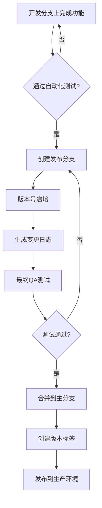

# 智能代理协作系统 - 版本发布说明

*基于AutoGen的多智能代理协作系统版本发布文档*

## 版本发布流程

### 版本编号规则

系统采用语义化版本控制 (SemVer) 规范：

- **主版本号 (X.0.0)**: 不兼容的API变更或重大功能重构
- **次版本号 (0.X.0)**: 向后兼容的功能新增
- **修订版本号 (0.0.X)**: 向后兼容的缺陷修复

### 发布流程



### 发布清单

**准备阶段:**
- [ ] 所有开发工作已完成并合并到开发分支
- [ ] 所有自动化测试通过
- [ ] 创建发布分支 `release/vX.Y.Z`
- [ ] 更新版本号(在`package.json`)
- [ ] 更新变更日志(`CHANGELOG.md`)

**测试阶段:**
- [ ] 在预发布环境进行部署
- [ ] 执行回归测试
- [ ] 验证新功能和修复
- [ ] 执行性能和安全测试

**发布阶段:**
- [ ] 将发布分支合并到主分支
- [ ] 创建版本标签 `vX.Y.Z`
- [ ] 部署到生产环境
- [ ] 监控部署状态和系统性能

**发布后:**
- [ ] 发布公告(如适用)
- [ ] 更新文档
- [ ] 进行发布回顾，记录经验教训

## 版本 0.1.0 (初始测试版)

**发布日期**: 2023年10月15日

### 新功能

🚀 **多智能代理会话系统**
- 支持创建多种预配置代理的协作会话
- 实现代理之间的自动化协作与通信
- 允许用户以自然语言方式与多代理系统交互

🧠 **代理角色与专业化**
- 提供5种预定义代理角色(研究员、想法生成器、批判思考者、协调者、总结者)
- 支持自定义代理角色和行为特征
- 每个代理使用特定提示工程技术优化其专业领域

🔄 **会话流管理**
- 基本的会话创建、暂停和恢复功能
- 会话历史记录的存储和查看
- 多轮对话支持与上下文保持

📊 **基础可视化**
- 代理交互流程的图形化展示
- 会话进度与状态指示器
- 代理贡献度简易统计

🔒 **安全与隐私**
- 基本用户认证与授权
- 会话数据加密存储
- 隐私设置控制

### 改进

- 初始版本，无改进项

### 修复

- 初始版本，无修复项

### 已知问题

- 并发会话数量超过5个时可能导致性能下降
- 某些复杂指令可能导致代理之间的循环对话
- 移动设备上的UI响应性有待优化
- 代理协作效率在某些专业领域任务中不够理想

### 兼容性说明

- 支持最新版Chrome、Firefox、Safari和Edge浏览器
- 移动设备支持有限，建议使用桌面环境
- 需要稳定的互联网连接以确保与LLM API的通信

## 版本 0.2.0 (计划中)

**计划发布日期**: 2023年12月10日

### 计划功能

- 代理行为的细粒度控制
- 改进的会话分析工具
- 支持导入外部知识库
- 代理协作模板库
- UI/UX全面优化

## 版本 1.0.0 (路线图)

**目标发布日期**: 2024年3月15日

### 愿景目标

- 全功能的智能代理协作平台
- 企业级安全性与可靠性
- 高级数据分析与可视化
- 跨平台全面支持
- API集成能力

## 变更日志维护指南

### 变更日志格式

变更日志应遵循以下格式:

```markdown
## 版本 X.Y.Z (状态)

**发布日期**: YYYY-MM-DD

### 新功能

- 新功能A的描述
- 新功能B的描述

### 改进

- 改进A的描述
- 改进B的描述

### 修复

- 修复A的描述
- 修复B的描述

### 已知问题

- 已知问题A的描述
- 已知问题B的描述
```

### 提交信息规范

提交信息应遵循以下约定:

- `feat`: 新功能
- `improve`: 功能改进
- `fix`: 缺陷修复
- `docs`: 仅文档变更
- `style`: 不影响代码含义的变更(空白、格式化等)
- `refactor`: 既不修复错误也不添加功能的代码变更
- `perf`: 改进性能的代码变更
- `test`: 添加或修正测试
- `chore`: 构建过程或辅助工具的变更

示例:
```
feat: 添加代理协作模板功能
fix: 修复长对话历史加载缓慢的问题
improve: 优化代理交互可视化效果
```

### 自动化变更日志

使用`standard-version`工具自动生成变更日志:

```bash
# 安装依赖
npm install --save-dev standard-version

# 在package.json添加脚本
# "scripts": {
#   "release": "standard-version"
# }

# 生成新版本
npm run release -- --release-as minor
```

## 版本控制策略

### 特性分支工作流

```
main        ●─────●─────●─────●─────●   主分支(稳定生产版本)
             \     \     \     /
dev          ●─────●─────●─────●        开发分支
               \     \   /
feature/x      ●─────●─●               特性分支
                 \
feature/y         ●─────●              特性分支
```

1. 从`dev`分支创建特性分支
2. 在特性分支上开发功能
3. 完成后创建PR合并回`dev`
4. 充分测试后，从`dev`创建发布分支
5. 发布分支合并回`main`并打标签

### 版本支持策略

- **最新版**: 完整支持所有功能和修复
- **次新版**: 重要安全修复
- **旧版**: 仅关键安全漏洞修复

## 发布公告模板

```
# 智能代理协作系统 v{版本号} 发布公告

我们很高兴地宣布智能代理协作系统 v{版本号} 现已正式发布！

## 主要亮点

{简要概述主要新功能和改进，3-5点}

## 详细功能列表

{分类列出所有新功能、改进和修复}

## 升级指南

{提供升级说明和注意事项}

## 反馈与支持

{提供反馈渠道和支持信息}

感谢您使用智能代理协作系统！
```

## 版本发布回顾模板

每次发布后，进行简短回顾并记录：

```
# 版本 {版本号} 发布回顾

**发布日期**: {日期}
**计划持续时间**: {计划天数}
**实际持续时间**: {实际天数}

## 成功之处

- {列出发布过程中做得好的地方}

## 挑战之处

- {列出发布过程中遇到的困难}

## 经验教训

- {列出可以改进的地方}

## 行动项

- {列出下次发布需要调整的具体行动}
```

## 初始版本发布计划

### 阶段1: 内部测试版(v0.1.0-alpha)

**时间线**: 2023年9月15日 - 2023年10月1日

**目标**:
- 核心功能验证
- 早期错误识别
- 性能基准测试

### 阶段2: 封闭测试版(v0.1.0-beta)

**时间线**: 2023年10月1日 - 2023年10月10日

**目标**:
- 扩大测试用户群
- 收集用户体验反馈
- 优化交互流程

### 阶段3: 公开测试版(v0.1.0)

**时间线**: 2023年10月15日

**目标**:
- 首次公开发布
- 建立用户基础
- 收集广泛使用场景数据 