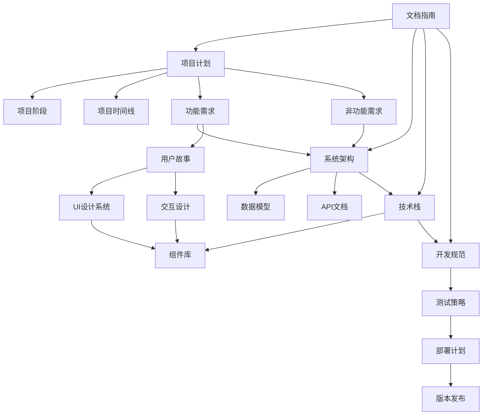

# 智能代理协作系统 - 项目文档指南

*基于AutoGen的多智能代理协作系统项目文档概览*

## 文档目录

本文档提供项目所有关键文档的概览，帮助您快速了解项目结构和各文档之间的关系。作为单人开发项目，这些文档旨在提供全面且精简的指南，确保开发过程的连贯性和可维护性。

```
项目文档
├── 1. 项目规划
│   ├── project_plan.md - 项目总体规划
│   ├── project_phases.md - 项目阶段和里程碑
│   ├── project_timeline.md - 项目时间线
│   ├── development_progress.md - 开发进度表
│   └── requirements_*.md - 需求文档(功能性和非功能性)
│
├── 2. 系统设计
│   ├── system_architecture.md - 系统架构设计
│   ├── data_model.md - 数据模型设计
│   ├── api_documentation.md - API接口文档
│   └── user_stories.md - 用户故事
│
├── 3. 技术规范
│   ├── tech_stack.md - 技术栈选择与理由
│   ├── component_library.md - 组件库规范
│   ├── ui_design_system.md - UI设计系统
│   └── interaction_design.md - 交互设计规范
│
├── 4. 开发指南
│   ├── development_guidelines.md - 开发规范与最佳实践
│   ├── testing_strategy.md - 测试策略
│   ├── deployment_plan.md - 部署计划
│   └── release_notes.md - 版本发布说明
│
└── 5. 补充文档
    └── project_documentation_guide.md - 本文档(文档指南)

└── assets/ - 文档图片、图表和其他资源文件
```

## 文档关系图

以下是文档之间的关系图，帮助您理解各文档间的依赖和关联：

```
┌────────────────────┐      ┌─────────────────────┐      ┌────────────────────┐
│    项目规划文档    │──────▶│    系统设计文档     │──────▶│   技术规范文档    │
│ (project_plan.md等)│◀─────┤(system_architecture│◀─────┤ (tech_stack.md等) │
└────────┬───────────┘      │    .md等)           │      └────────┬───────────┘
         │                  └──────────┬──────────┘               │
         │                             │                          │
         │                             ▼                          │
         │                  ┌─────────────────────┐              │
         └─────────────────▶│    开发指南文档     │◀─────────────┘
                            │(development_guideli│
                            │   nes.md等)         │
                            └─────────┬───────────┘
                                      │
                                      ▼
                            ┌─────────────────────┐
                            │     补充文档        │
                            │(project_documentati│
                            │  on_guide.md)      │
                            └─────────────────────┘
```

### 文档依赖说明

1. **项目规划文档**是所有其他文档的基础，定义了项目的目标、范围和计划
   - 直接影响系统设计文档和开发指南文档

2. **系统设计文档**基于项目规划，定义了系统的技术架构和功能实现
   - 影响技术规范文档中的技术选择
   - 指导开发指南文档中的实施方案

3. **技术规范文档**基于系统设计，详细规定了技术实现标准
   - 直接影响开发指南中的编码规范和实践

4. **开发指南文档**整合了前三类文档的要求，提供具体的开发、测试和部署指导

5. **补充文档**（本文档）提供了所有文档的概览和导航指南

## 1. 项目规划文档

### [project_plan.md] 项目总体规划

**概述**: 提供项目的总体目标、范围、关键功能和高层次规划。
**用途**: 作为项目的指南针，指导整体开发方向和优先级。
**关键内容**: 
- 项目背景与目标
- 项目规模与约束
- 关键功能列表
- 成功标准
- 风险评估

### [project_phases.md] 项目阶段和里程碑

**概述**: 详细描述项目的各个开发阶段和关键里程碑。
**用途**: 帮助规划开发节奏，明确每个阶段的目标和可交付成果。
**关键内容**:
- 阶段划分与目标
- 里程碑定义
- 每个阶段的范围和成果
- 验收标准

### [project_timeline.md] 项目时间线

**概述**: 提供项目开发的具体时间计划。
**用途**: 作为项目管理工具，跟踪进度和计划调整。
**关键内容**:
- 详细的时间安排
- 关键节点和截止日期
- 资源分配
- 依赖关系管理

### [development_progress.md] 开发进度表

**概述**: 全面追踪项目各模块开发进度的动态文档。
**用途**: 实时监控项目进展，识别风险，调整开发计划。
**关键内容**:
- 整体项目进度概览
- 分模块任务跟踪（前端、后端、代理引擎、数据存储、DevOps）
- 当前重点任务
- 风险与问题跟踪
- 里程碑达成状态
- 进度更新历史记录
- 完成标准定义

### [requirements_functional.md] 功能性需求

**概述**: 详细描述系统的功能性需求。
**用途**: 明确系统需要实现的具体功能，用于指导开发。
**关键内容**:
- 用户功能需求
- 系统功能需求
- 代理功能需求
- 协作功能需求

### [requirements_nonfunctional.md] 非功能性需求

**概述**: 描述系统性能、安全、可用性等非功能性需求。
**用途**: 确保系统满足质量和性能标准。
**关键内容**:
- 性能需求
- 安全需求
- 可用性需求
- 可扩展性需求
- 兼容性需求

## 2. 系统设计文档

### [system_architecture.md] 系统架构设计

**概述**: 详细描述系统的总体架构和组成部分。
**用途**: 提供系统的蓝图，指导技术实现。
**关键内容**:
- 架构概览
- 系统组件与模块
- 组件间交互
- 技术选择理由
- 数据流
- 扩展点

### [data_model.md] 数据模型设计

**概述**: 详细的数据模型规范和数据库设计。
**用途**: 指导数据库实现和数据操作设计。
**关键内容**:
- 实体关系图
- 数据表定义
- 关系定义
- 数据流程
- 持久化策略
- 数据安全考量

### [api_documentation.md] API接口文档

**概述**: 系统所有API接口的详细规范。
**用途**: 指导前后端交互实现，并作为自测参考。
**关键内容**:
- RESTful API规范
- 请求/响应格式
- 状态码
- 身份验证
- 错误处理
- 示例请求/响应

### [user_stories.md] 用户故事

**概述**: 从用户视角描述系统功能和使用场景。
**用途**: 将技术需求转化为用户视角的场景，指导用户体验设计。
**关键内容**:
- 用户角色定义
- 详细用户故事
- 验收标准
- 优先级

## 3. 技术规范文档

### [tech_stack.md] 技术栈选择

**概述**: 项目所使用技术栈的详细说明。
**用途**: 记录技术选择决策过程,指导开发环境搭建。
**关键内容**:
- 前端技术栈
- 后端技术栈
- 数据库选择
- AI/机器学习技术
- 工具和库
- 选择理由
- 替代方案分析

### [component_library.md] 组件库规范

**概述**: 系统UI组件库的设计和技术规范。
**用途**: 指导UI组件开发，确保界面一致性。
**关键内容**:
- 组件分类
- 组件属性
- 交互规则
- 实现指南
- 使用示例

### [ui_design_system.md] UI设计系统

**概述**: 系统视觉风格和设计规范。
**用途**: 确保UI设计的一致性和美观性。
**关键内容**:
- 设计理念
- 色彩系统
- 排版规范
- 间距规则
- 图标系统
- 响应式设计
- 交互动效

### [interaction_design.md] 交互设计规范

**概述**: 系统交互模式和用户体验设计规范。
**用途**: 指导系统交互设计，优化用户体验。
**关键内容**:
- 交互设计原则
- 用户流程
- 导航结构
- 反馈机制
- 错误处理
- 无障碍设计

## 4. 开发指南文档

### [development_guidelines.md] 开发规范

**概述**: 项目开发的规范和最佳实践。
**用途**: 确保代码质量和一致性，减少技术债务。
**关键内容**:
- 开发流程
- 编码规范
- Git工作流
- 代码审查准则
- 文档要求
- 安全最佳实践

### [testing_strategy.md] 测试策略

**概述**: 系统测试的全面策略和方法。
**用途**: 指导测试活动，确保软件质量。
**关键内容**:
- 测试类型
- 测试环境
- 测试覆盖率要求
- 自动化测试
- 测试工具
- 测试流程

### [deployment_plan.md] 部署计划

**概述**: 系统部署的详细计划和流程。
**用途**: 指导系统部署和环境配置。
**关键内容**:
- 部署架构
- 环境配置
- 部署流程
- 回滚策略
- 监控方案
- 安全考量

### [release_notes.md] 版本发布说明

**概述**: 版本发布流程和初始版本发布说明。
**用途**: 管理版本发布过程，记录版本变更。
**关键内容**:
- 发布流程
- 版本控制策略
- 变更日志
- 版本历史
- 发布计划

## 5. 补充文档

### [project_documentation_guide.md] 项目文档指南

**概述**: 提供项目所有文档的概述和相互关系（本文档）。
**用途**: 帮助理解项目文档结构，快速查找所需信息。
**关键内容**:
- 文档目录
- 文档间关系
- 文档用途
- 更新维护指南

## 文档间关系图



## 文档维护指南

为确保项目文档的持续有效性和一致性，请遵循以下维护指南：

### 文档版本控制

1. **使用Git跟踪所有文档变更**
   - 文档更改应与相关代码更改一起提交
   - 使用明确的提交信息说明文档变更内容

2. **记录更新历史**
   - 在大型文档底部保留更新记录部分
   - 包含日期、作者和主要变更内容

3. **一致性检查**
   - 在更新文档时，检查相关文档是否需要同步更新
   - 确保所有相互引用保持一致
   - 定期检查文档间的链接

4. **定期审查**
   - 每个开发里程碑对文档进行完整审查
   - 移除过时内容，更新不准确信息
   - 确保文档与当前实现保持一致

### 文档格式规范

1. **统一格式**
   - 所有文档使用Markdown格式
   - 遵循一致的标题层级结构
   - 使用统一的列表格式和代码块样式

2. **链接规范**
   - 使用相对路径链接项目内文档
   - 外部资源使用完整URL
   - 确保所有链接都是可访问的

3. **图片和图表**
   - 图片存放在专用assets目录
   - 使用清晰的文件命名
   - 提供图片的文本描述

## 新用户快速入门

如果您是新加入项目的开发者，以下指南将帮助您快速了解项目文档：

### 建议首先阅读的文档

1. **项目概览**
   - [项目计划](../1.%20项目规划/project_plan.md) - 了解项目目标和范围
   - 本文档 - 了解文档结构

2. **技术基础**
   - [技术栈](../3.%20技术规范/tech_stack.md) - 熟悉项目使用的技术
   - [系统架构](../2.%20系统设计/system_architecture.md) - 理解系统结构

3. **开发准备**
   - [开发规范](../4.%20开发指南/development_guidelines.md) - 学习编码规范和流程
   - [测试策略](../4.%20开发指南/testing_strategy.md) - 了解测试方法

### 开发过程中常用参考

1. **功能开发**
   - [用户故事](../2.%20系统设计/user_stories.md) - 理解功能需求
   - [API文档](../2.%20系统设计/api_documentation.md) - 查阅API规范
   - [数据模型](../2.%20系统设计/data_model.md) - 查看数据结构

2. **UI实现**
   - [UI设计系统](../3.%20技术规范/ui_design_system.md) - 确保设计一致性
   - [组件库](../3.%20技术规范/component_library.md) - 使用预定义组件
   - [交互设计](../3.%20技术规范/interaction_design.md) - 实现用户交互

3. **部署与发布**
   - [部署计划](../4.%20开发指南/deployment_plan.md) - 跟踪部署流程
   - [版本发布](../4.%20开发指南/release_notes.md) - 了解版本控制

## 文档工具

### 文档自动更新工具

为了确保项目文档与代码保持同步，我们开发了文档自动更新工具。该工具能在代码变更时自动更新：

1. **开发进度表** - 根据代码变更自动调整各模块的完成度
2. **相关技术文档** - 自动添加更新记录到相关技术文档

详细信息请参考[文档自动更新指南](../4.%20开发指南/document_update_guide.md)。

工具脚本位置：
- 主脚本：`scripts/update-docs.js`
- 安装脚本：`scripts/install-hooks.js`

安装命令：
```bash
npm run install-hooks
```

使用命令：
```bash
npm run update-docs
```

### 文档维护最佳实践

1. **保持文档与代码同步** - 利用文档自动更新工具追踪变更
2. **遵循统一格式** - 每个文档类型应遵循相同的格式和结构
3. **定期审查** - 每月审查文档是否过时或需要更新
4. **添加修订记录** - 重要文档更新应在文档底部添加修订记录
5. **链接相关文档** - 在文档之间添加相互引用，提高文档的连贯性

---

*最后更新: 2023年10月10日* 